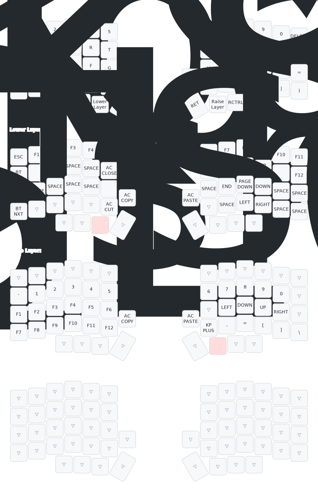

# Lily58 ZMK Config

My personal ZMK configuration for the Lily58 split keyboard with nice!nano v2 controllers.

## Current Layout

## Features

- Colemak-DH base layout
- Home row mods (Shift on A and O)
- 4 layers: Base, Lower, Raise, and Adjust
- Bluetooth controls on Adjust layer
- RGB underglow controls (if installed)
- Volume and page scroll on encoders (if installed)

## Building Firmware

This repository uses GitHub Actions to automatically build firmware when changes are pushed.

1. Edit `config/lily58.keymap` with your desired layout
2. Commit and push changes
3. GitHub Actions will build the firmware automatically
4. Download firmware from Actions tab → latest workflow → Artifacts
5. Flash the `.uf2` files to your keyboard

## Flashing Instructions

### Initial Setup (both halves)
1. Flash left half: Connect via USB, enter bootloader, copy `lily58_left_nice_nano_v2.uf2`
2. Flash right half: Connect via USB, enter bootloader, copy `lily58_right_nice_nano_v2.uf2`

### Keymap Updates (left only)
After initial setup, only the left half needs to be flashed for keymap changes.

## Layout Customization

### Using ZMK Studio
You can modify your keymap without rebuilding using [ZMK Studio](https://zmk.studio/)

### Using Keymap Editor
Visual editing available at [keymap-editor](https://nickcoutsos.github.io/keymap-editor/)

### Manual Editing
Edit `config/lily58.keymap` directly and push to trigger a rebuild.

## Visualization

The keymap visualization is automatically generated using [keymap-drawer](https://github.com/caksoylar/keymap-drawer) whenever the keymap is updated.
